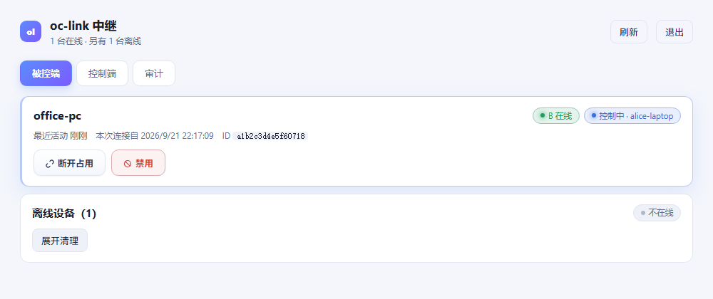
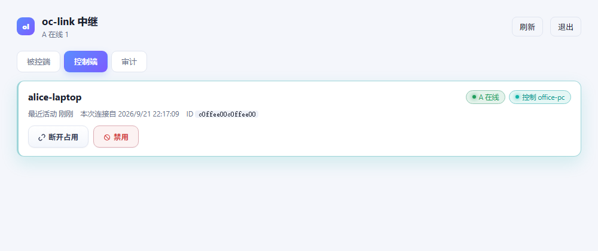

# ocwire

**Chat-native remote control for [opencode](https://opencode.ai) / OpenChamber — through a blind relay with end-to-end encryption.**

Control your other computers by talking to your AI agent: run commands, read/write files, grep, transfer — all from the opencode chat. No open ports, no VPN, no SSH. The relay never sees plaintext and never holds a key.

> 中文说明在下方。Internally the project is still called `oc-link`; `ocwire` is the public name.

```
 A side (your chat)                 blind relay                  B side (target)
┌──────────────────────┐        ┌──────────────┐        ┌──────────────────────┐
│ opencode / OpenChamber│        │  ocwire-hub  │        │ ocwire-desktop (GUI) │
│  └─ plugin (engine)  │◄──────►│  TLS 1.3     │◄──────►│  or oclink-agent CLI │
│      oc_exec / oc_read│  E2EE  │  no keys     │  E2EE  │  127.0.0.1 → tools   │
└──────────────────────┘        └──────────────┘        └──────────────────────┘
```

## Features

- **Chat-native ops** — the A-side engine lives inside opencode as a plugin, so `oc_exec`, `oc_read`, `oc_write`, `oc_grep`, `oc_glob`, `oc_list`, `oc_edit` just work from chat.
- **Blind relay** — the hub stores only `deviceId` (a hash) and per-client verification subkeys. It cannot decrypt, forge, or replay traffic (HKDF-separated keys, X25519 + AES-256-GCM, monotonic seq as AAD).
- **Zero exposure** — both sides dial out to the relay; no inbound ports, certificate fingerprint pinning end to end.
- **Self-service onboarding** — targets self-register on first launch, pair with an `OCL2:` invite code (QR / paste). Each controller gets its own credential.
- **Per-controller control** — kick, disable, enable, temporary cooldown, per-credential audit; offline-device cleanup from the admin console.
- **Presence** — the A engine keeps a heartbeat connection so "A online / A offline" means what it says (and the UI never flickers).
- **Signed auto-update** — agents verify an Ed25519-signed release manifest before upgrading.
- **Desktop (Wails), CLI agent, OpenChamber panel** — the same engine, three faces. Windows / Linux / macOS builds.

## Screenshots

Admin console (relay) — devices, per-controller control, offline cleanup:



Every controller credential, live state and revocation:



> Screenshots use demo data. More (desktop client, OpenChamber panel) coming.

## Quick start

### 1. Relay (a small VPS, or your LAN)

```bash
go build -o oclink-hub ./cmd/hub
./oclink-hub -tunnel :21122 -admin :10000 -data /opt/ocwire/data
# first run prints a random admin password; open http://<host>:10000
```

### 2. B side (the machine to control)

- GUI: download `ocwire-desktop.zip`, run `oc-link.exe`, first launch self-registers. Click **生成邀请码** and send the code to the A side.
- CLI: `oclink-agent -register -hub <relay> -fingerprint <cert-fp>` prints an invite code.

### 3. A side (opencode)

```bash
# copy plugin files into opencode, then restart the shell
cp plugin/client.mjs plugin/oc-link.ts ~/.config/opencode/plugins/
```

Then in chat: paste the invite code and say *"add this device"* — or call `oc_add` yourself.
After that: *"connect MS8323-1"*, *"run `df -h` on MS8323-1"*, *"read /etc/hosts on MS8323-1"*.

## Security model (short version)

| Threat | Mitigation |
|---|---|
| Relay operator | Never receives keys; stores only verification subkeys (`HKDF(key,"auth")`) |
| Network MITM | TLS 1.3 with pinned SHA-256 fingerprint on both sides |
| Stolen invite | Single-device, revocable credential; per-controller disable/kick |
| Replay / reorder | Monotonic `seq` bound as AES-GCM AAD; strict receive ordering |
| Forged relay | E2EE handshake mixes X25519 with the shared `encKey`, so a MITM cannot complete |

See [SECURITY.md](SECURITY.md) for details.

## Repository layout

```
cmd/hub          relay + admin console
cmd/agent        CLI agent (B side, headless)
internal/hub     relay: tunnel, store, audit, admin API
internal/agent   agent runtime (service mode, auto-update)
internal/client  protocol client used by tests/tools
internal/proto   envelopes, HKDF key schedule, E2EE sessions
internal/wire    framing (4-byte length prefix, 32MB cap)
plugin/          opencode plugin: A engine + tools        → A side
extension/       OpenChamber panel (devices / add / log)  → A side UI
desktop/         Wails GUI client (B full features, A page)
docs/            architecture notes
```

## Acknowledgements

- [opencode](https://github.com/sst/opencode) by SST — the agent runtime this project plugs into. The A-side engine is loaded as an opencode plugin; the code here is independent, no source is vendored from opencode.
- [OpenChamber](https://github.com/openchamber/openchamber) — the shell/UI that hosts the opencode runtime and the extension panel. The panel uses the published `@openchamber/sdk`.
- Runtime dependencies: `@opencode-ai/plugin` and `@openchamber/sdk` (both MIT).

**ocwire is an independent community project.** It is not affiliated with, endorsed by, or sponsored by the opencode or OpenChamber projects. All trademarks belong to their respective owners.

## Status

v0.1 — developed and tested end-to-end (relay / desktop / agent / plugin / panel), with Go unit tests for the hub and E2E tests for the desktop module. Docs and CI are being tidied for the public release. Issues and PRs welcome.

## Development

```bash
go build ./cmd/hub ./cmd/agent        # relay + agent
go test ./internal/...                # unit tests
cd desktop && go vet . && wails build # GUI (needs wails CLI)
node --check plugin/client.mjs        # plugin syntax check
```

## License

MIT — see [LICENSE](LICENSE).

---

# 中文说明

**用聊天控制你的其他电脑**：A 端引擎是 opencode/OpenChamber 插件，在聊天里直接执行命令、读写文件；中间是一台**全盲中继**（拿不到密钥、看不到内容）；B 端是桌面客户端或命令行 agent。**不开端口、不用 VPN、不用 SSH。**

- 首次使用：B 端启动自动登记 → 点「生成邀请码」→ A 端在聊天里粘贴添加
- 之后直接说：「连接 XX」「在 XX 上执行 df -h」「读一下 XX 的某个文件」
- 每台控制端一把独立钥匙：可单独禁用/踢下线/删除；管理台有审计（保留 3 天）、离线设备清理
- 端到端加密 + 指纹钉死；中继只有哈希 ID 和校验子键，永远解不开、也伪造不了

安装与使用见上方 Quick start；安全模型见 [SECURITY.md](SECURITY.md)。
